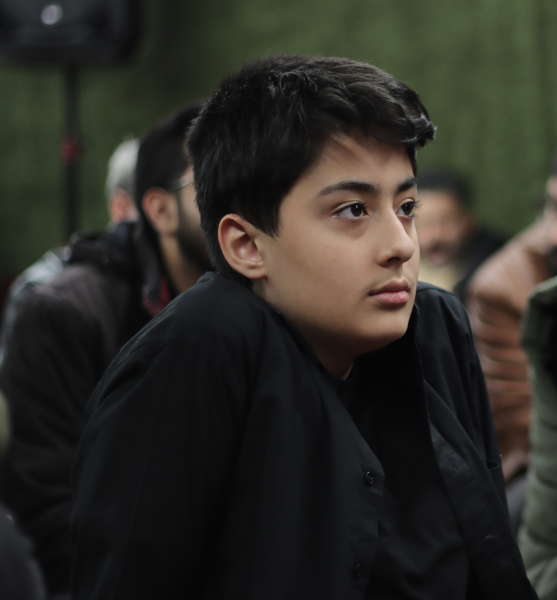
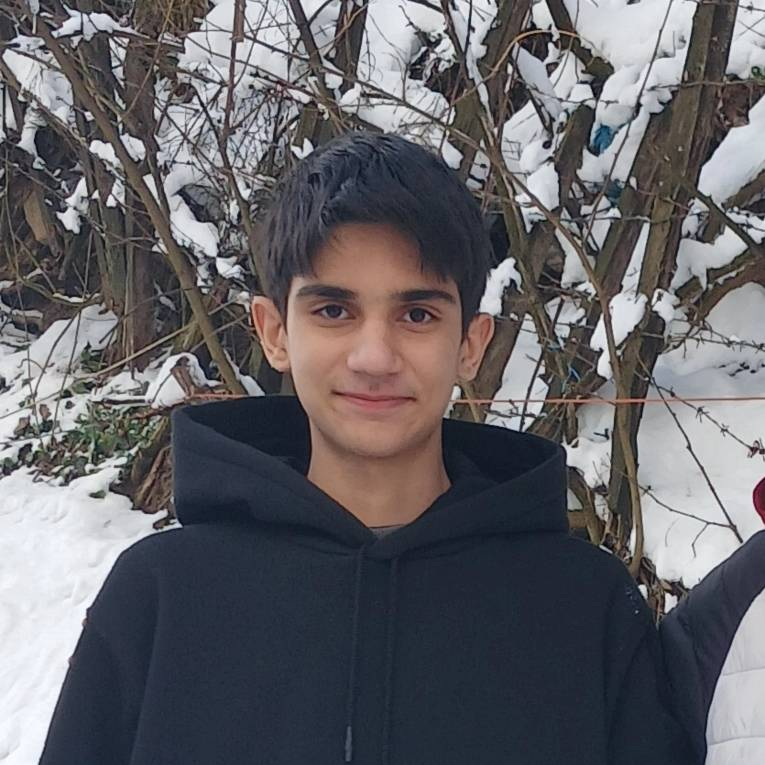
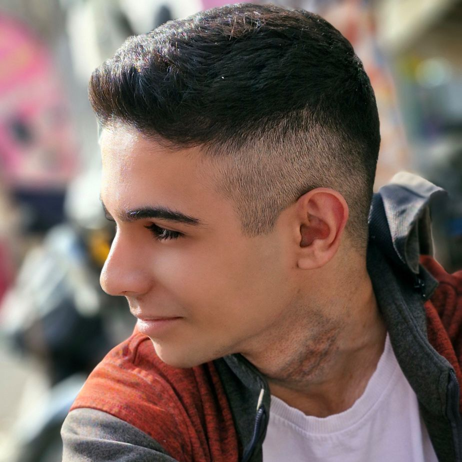
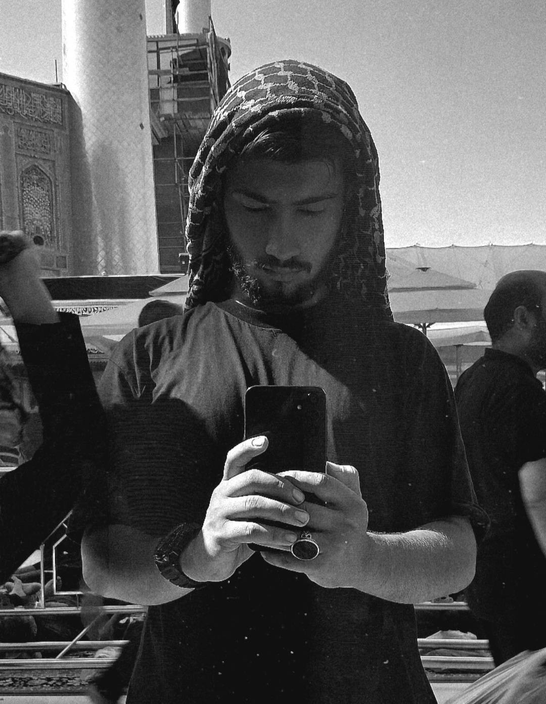

# 🎬 NeuroCraft
## 🚀 AI‑Powered Digital Content & Mobile App Development Team

> **"We don’t just build apps — we craft intelligence."**

---

## 🎮 About the Event
**The First AI‑Based Digital Content Creation Event**  
Organized by **Basij Danesh‑Amoozi** ✌️  

This event challenges participants to create:
- 📱 Mobile Applications
- 🎮 Games
- 🎨 Digital Content  

powered by **Artificial Intelligence**, creativity, and modern technology.

We are here to build impactful digital products and shape the future. 🔥

---
## 🏫 Academic & Educational Affiliation
This team is proudly formed and supported by:

**Nemouneh Dolati – Mandegar Intelligent Art School  
Imam Sadegh (AS)**  
from the esteemed **Modares School of Smart Arts Mandegar Imam Sadegh  

In collaboration with the educational institute:

**Pouyeshgaran Danesh & Maharat Sadra Institute**  
*A professional institute dedicated to developing advanced technical, digital, and future‑ready skills.*

---

## 🧠 Who We Are
**NeuroCraft** is a motivated and forward‑thinking team specializing in:

- Mobile App Development (React Native)
- Artificial Intelligence & Prompt Engineering
- Clean Architecture & Scalable Systems
- User‑Centered Digital Experiences

We don’t just participate in competitions —  
**we aim to lead, innovate, and inspire.**

---

## 🛠️ Tech Stack
- ⚛️ React Native (Expo)
- 📘 TypeScript
- 🤖 Artificial Intelligence
- 🧠 Prompt Engineering
- 🎨 Modern UI / UX Design
- ☁️ Scalable & Cloud‑Ready Architecture

---

## 👥 Team Members

<table>
<tr>
<td align="center">
 
<b>Taha Batoomi</b> 
🚀 <i>Team Lead</i> 
React Native Developer
</td>

<td align="center">
 
<b>Reza Farajpour</b> 
⚛️ React Native Developer
</td>

<td align="center">
 
<b>Amir Ali Hasanzadeh</b> 
⚛️ React Native Developer
</td>

<td align="center">
 
<b>Mahdi Salimi Dana</b> 
🧠 Prompt Engineer & AI Developer
</td>
</tr>
</table>

---

## 🌟 Our Vision
We believe the future belongs to those who:
- **Build with purpose**
- **Think deeply and creatively**
- **Use AI responsibly and intelligently**

NeuroCraft exists to transform ideas into intelligent, real‑world digital solutions.

---

## 🔥 Current Status
✅ Team Assembled  
✅ Educational & Technical Support Established  
✅ Technology Stack Ready  
✅ AI‑Driven Vision Defined  
✅ Ready to Build, Compete, and Win 🚀

---

> **NeuroCraft — Crafting the Future with AI**
